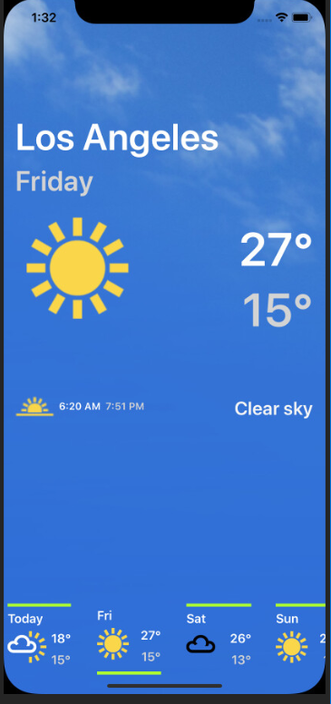

# WeatherApp
Sample weather app built using Xamain Forms with support for:

- iOS
- Android

App queries OpenWeatherMap.org to get weather forecast for the device's location for a period of 7 days.

### Technology Stack used
- Xamarin Forms 4.4
- MVVM Helpers
- TimeZoneConverter
- Xamarin Essentials
- Xamanimation

#### Tests
Using xUnit to mock out the service and test the indicidual components.

#### Prerequisites
On both Android and IOS Simulators setup a Location for the app to automatically read Geo Coordinates.

 